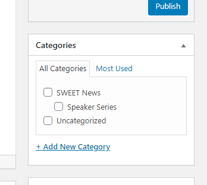

# Important Links:

Github Page: <a href="https://github.com/EthanMerrill/WPI-SWEET-Website-HTML">https://github.com/EthanMerrill/WPI-SWEET-Website-HTML</a>

# Functional Instructions:

## How to Log In

Navigate to <a href="https://wp.wpi.edu/sweet/wp-admin/">https://wp.wpi.edu/sweet/wp-admin/</a> and log in using your WPI credentials. 

## How to Make A Post

Go to Posts-->New Post in the sidebar. Edit the post content using the textbox. THe post can be previewed by clicking the Preview post button in the upper left corner. Posts can the thought of as news articles. The articles will appear in the news page only if the "SWEET News" category is selected under the categories section of the page:

Once you are ready to publish the page, click publish.

## How to Add A Page

In the sidebar go to Page-->Add New. You will be presented with a blank page. If you would like to link to the page from another, use the visual tab(default) to make simple page edits. To add custom HTML See the section below.

To publish, click the publish button in the upper right of the screen. 

*Note that Most new Pages should use the "full width template"*

## Add Media

Add media by navigating to Media --> Add New in the sidebar. You will be prompted to select the files you would like to import from your computer.

### Add Media to a Post Or Page

To add media to an existing post or page while using the visual editor, select the Add media button in the top right of the editor area. 

**Note that media is only stored on the WP install and not backed up to Github**

## Modify the Theme:

Go to Appearance--> customize to modify the existing theme. 

## Change the Theme:
The current theme is called **unlimited**. To select a different currently available theme navigate to Appearance--> Themes in the sidebar. Then hover over the theme you would like and click Activate

## How to Change Or Update Custom HTML and CSS
The following techniques can be applied to both pages and posts to further customize the look and feel of pages and posts on the site. However at this time the theme is not able to be modified (to my understanding).

While developing the site, I used Github to log and track site changes. This meant that I copied and pasted every post into Wordpress from an ide. This way all pages will be backed up externally from the Wordpress site.  

### HTML
To see the complete HTML markdown switch to the text tab of the editor while viewing the page you would like edit in the Wordpress Admin console. 

In this view add or modify any HTML you would like.

Please note that you must disable the Wordpress Auto Paragraphing with this checkbox pictured below:
*DISABLE WPAUTOP*

### CSS
All of the CSS for the site is stored in one file. The backup of this file is located in the Github. To update the file in the Wordpress navigate to Appearance-->Custom CSS in the sidebar:

Once you have completed the edits, save them in the upper right. 

# Future Development

